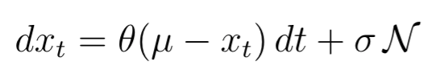
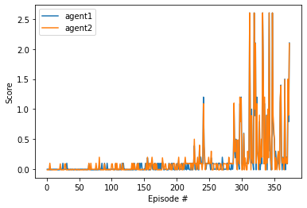
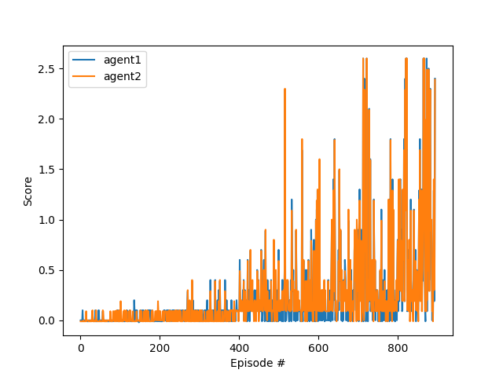
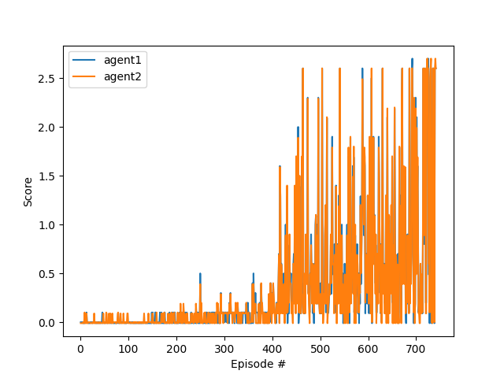
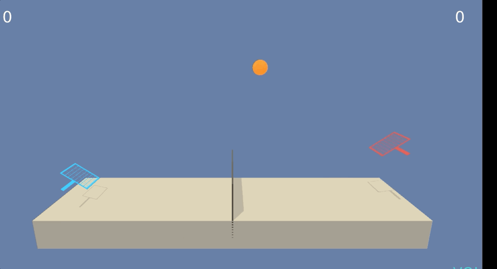

## Learning Algorithm

The network was trained with MADDPG using 3-layer network for Actor with PyTorch layers:

1. Linear(24,256)
2. Linear(256,128)
3. Linear(128,2).

The input was 24 state-size input and the network returned 2 action values from 0 to 1.

Beside that, it was used also 3-layer Critic Network, which takes 48-states (for both agents) and 4-action values (both agents) as input

1. Linear(24+24,256)
2. Linear(256+4,128)
3. Linear(128,1).

and returns the Q-value.


Both agents have actor and critic, also in local and target version.
The actor takes local state action for current agent and provide actions.
The critic has states from both agents and it has also both information about provided actions.

Also, there was used standard replay buffer. 

Also the Ornstein–Uhlenbeck process noise was added to actions values in a form.



Also, there was added some gain to the noise to the action, which decreases over time. 
The parameters of the gains was:
```
NOISE_GAIN_INITIAL = 5
NOISE_GAIN_END = 0
NOISE_DECAY = 0.001
```
After each training step the gain value is decreased by NOISE_DECAY parameter.
Increasing the noise signal was crucial for agent to start learning how to play and it also adds randomness 
for continuous actions


The results are provided in ```Tennis-solution-training.ipynb``` and ```Tennis-solution-evaluation.ipynb```.
Thie first one contains a training procedure and the second one is used for evaluation for the best model.
The application can be also run with python-script ```main.py```.


Network hyperparameters used:

```
BUFFER_SIZE = int(1e6)  # replay buffer size
BATCH_SIZE = 128        # minibatch size
GAMMA = 0.99            # discount factor
TAU = 0.05              # for soft update of target parameters
LR_ACTOR = 1e-3         # learning rate of the actor
LR_CRITIC = 1e-3        # learning rate of the critic

```

## Progress

The training procedure (provided in a jupyer notebook) has a form:

```
Episode 10	Average Score: 0.01000	Current Score: 0.00000 -0.01000
Episode 20	Average Score: 0.00500	Current Score: -0.01000 0.00000
Episode 30	Average Score: 0.01567	Current Score: 0.00000 -0.01000
Episode 40	Average Score: 0.01425	Current Score: 0.00000 -0.01000
Episode 50	Average Score: 0.01140	Current Score: -0.01000 0.00000
Episode 60	Average Score: 0.00950	Current Score: 0.00000 -0.01000
Episode 70	Average Score: 0.01100	Current Score: -0.01000 0.00000
Episode 80	Average Score: 0.01088	Current Score: -0.01000 0.00000
Episode 90	Average Score: 0.01411	Current Score: 0.00000 -0.01000
Episode 100	Average Score: 0.01460	Current Score: 0.00000 0.09000
Episode 110	Average Score: 0.01650	Current Score: -0.01000 0.00000
Episode 120	Average Score: 0.02040	Current Score: 0.00000 -0.01000
Episode 130	Average Score: 0.01670	Current Score: 0.00000 -0.01000
Episode 140	Average Score: 0.02060	Current Score: 0.10000 -0.01000
Episode 150	Average Score: 0.02460	Current Score: 0.00000 -0.01000
Episode 160	Average Score: 0.03160	Current Score: 0.00000 -0.01000
Episode 170	Average Score: 0.03830	Current Score: 0.10000 -0.01000
Episode 180	Average Score: 0.04320	Current Score: -0.01000 0.00000
Episode 190	Average Score: 0.04290	Current Score: 0.00000 -0.01000
Episode 200	Average Score: 0.04670	Current Score: -0.01000 0.00000
Episode 210	Average Score: 0.05150	Current Score: 0.09000 0.100000
Episode 220	Average Score: 0.05720	Current Score: -0.01000 0.10000
Episode 230	Average Score: 0.07110	Current Score: 0.10000 -0.01000
Episode 240	Average Score: 0.07910	Current Score: 0.09000 0.100000
Episode 250	Average Score: 0.10100	Current Score: 0.10000 0.090000
Episode 260	Average Score: 0.10560	Current Score: 0.00000 0.090000
Episode 270	Average Score: 0.10650	Current Score: 0.20000 -0.01000
Episode 280	Average Score: 0.11120	Current Score: 0.09000 0.200000
Episode 290	Average Score: 0.13210	Current Score: 0.19000 0.300000
Episode 300	Average Score: 0.17310	Current Score: 0.10000 -0.01000
Episode 310	Average Score: 0.18230	Current Score: 0.10000 0.090000
Episode 320	Average Score: 0.26150	Current Score: 0.89000 1.000000
Episode 330	Average Score: 0.30360	Current Score: 0.39000 0.500000
Episode 340	Average Score: 0.37170	Current Score: 0.89000 1.000000
Episode 350	Average Score: 0.43180	Current Score: 0.50000 0.490000
Episode 360	Average Score: 0.45910	Current Score: 1.40000 1.390000
Episode 370	Average Score: 0.47650	Current Score: 0.09000 0.100000
Episode 373	Average Score: 0.51860	Current Score: 2.10000 2.09000
Environment solved in 273 episodes!	Average Score: 0.52
```


Although, the agent was trained properly (```checkpoints_jup/checkpoint.py```), in real benchmark the result wasn't good enough.
Therefore, after a few attempts the requested score was increased to 0.8 and 1.0
The results provided below was done using ```main.py``` runs.

```
Episode 10      Average Score: 0.01000  Current Score: 0.00000 -0.01000
Episode 20      Average Score: 0.00950  Current Score: -0.01000 0.00000
Episode 30      Average Score: 0.00933  Current Score: 0.00000 0.090000
Episode 40      Average Score: 0.01450  Current Score: -0.01000 0.10000
Episode 50      Average Score: 0.01560  Current Score: -0.01000 0.00000
Episode 60      Average Score: 0.01617  Current Score: 0.00000 -0.01000
Episode 70      Average Score: 0.01386  Current Score: -0.01000 0.00000
Episode 80      Average Score: 0.01325  Current Score: -0.01000 0.00000
Episode 90      Average Score: 0.01578  Current Score: 0.00000 -0.01000
Episode 100     Average Score: 0.01820  Current Score: 0.00000 -0.01000
Episode 110     Average Score: 0.02090  Current Score: -0.01000 0.00000
Episode 120     Average Score: 0.02390  Current Score: 0.00000 -0.01000
Episode 130     Average Score: 0.02680  Current Score: 0.00000 -0.01000
Episode 140     Average Score: 0.02870  Current Score: -0.01000 0.00000
Episode 150     Average Score: 0.02960  Current Score: -0.01000 0.00000
Episode 160     Average Score: 0.03450  Current Score: 0.00000 -0.01000
Episode 170     Average Score: 0.04030  Current Score: 0.10000 -0.01000
Episode 180     Average Score: 0.04620  Current Score: 0.00000 0.090000
Episode 190     Average Score: 0.04730  Current Score: 0.00000 0.090000
Episode 200     Average Score: 0.05060  Current Score: 0.00000 0.090000
Episode 210     Average Score: 0.05050  Current Score: 0.00000 0.090000
Episode 220     Average Score: 0.05510  Current Score: 0.00000 0.090000
Episode 230     Average Score: 0.05980  Current Score: -0.01000 0.00000
Episode 240     Average Score: 0.06340  Current Score: 0.09000 0.100000
Episode 250     Average Score: 0.06910  Current Score: 0.09000 0.100000
Episode 260     Average Score: 0.06920  Current Score: 0.09000 0.100000
Episode 270     Average Score: 0.07120  Current Score: 0.20000 0.090000
Episode 280     Average Score: 0.07330  Current Score: 0.10000 -0.01000
Episode 290     Average Score: 0.07760  Current Score: 0.10000 -0.01000
Episode 300     Average Score: 0.07810  Current Score: -0.01000 0.00000
Episode 310     Average Score: 0.08050  Current Score: 0.00000 -0.01000
Episode 320     Average Score: 0.07900  Current Score: 0.20000 0.090000
Episode 330     Average Score: 0.08230  Current Score: 0.00000 0.090000
Episode 340     Average Score: 0.08180  Current Score: 0.40000 0.390000
Episode 350     Average Score: 0.08120  Current Score: 0.10000 -0.01000
Episode 360     Average Score: 0.08430  Current Score: 0.10000 -0.01000
Episode 370     Average Score: 0.08940  Current Score: 0.10000 -0.01000
Episode 380     Average Score: 0.08740  Current Score: -0.01000 0.10000
Episode 390     Average Score: 0.09030  Current Score: 0.10000 -0.01000
Episode 400     Average Score: 0.09350  Current Score: 0.10000 0.090000
Episode 410     Average Score: 0.10740  Current Score: 0.30000 0.19000
Episode 420     Average Score: 0.11730  Current Score: 0.20000 0.190000
Episode 430     Average Score: 0.13140  Current Score: 0.10000 0.190000
Episode 440     Average Score: 0.14140  Current Score: 0.19000 0.200000
Episode 450     Average Score: 0.15640  Current Score: 0.10000 -0.01000
Episode 460     Average Score: 0.16930  Current Score: 0.10000 0.090000
Episode 470     Average Score: 0.19320  Current Score: 0.00000 0.090000
Episode 480     Average Score: 0.20210  Current Score: -0.01000 0.10000
Episode 490     Average Score: 0.21110  Current Score: 0.10000 -0.01000
Episode 500     Average Score: 0.22300  Current Score: 0.70000 0.590000
Episode 510     Average Score: 0.22170  Current Score: 0.40000 0.290000
Episode 520     Average Score: 0.24670  Current Score: 0.09000 0.100000
Episode 530     Average Score: 0.24070  Current Score: 0.10000 0.090000
Episode 540     Average Score: 0.26350  Current Score: 0.19000 0.300000
Episode 550     Average Score: 0.26410  Current Score: 0.09000 0.100000
Episode 560     Average Score: 0.26920  Current Score: 0.10000 0.090000
Episode 570     Average Score: 0.26140  Current Score: 0.30000 0.290000
Episode 580     Average Score: 0.27460  Current Score: 0.29000 0.400000
Episode 590     Average Score: 0.28660  Current Score: -0.01000 0.10000
Episode 600     Average Score: 0.30740  Current Score: 0.10000 0.190000
Episode 610     Average Score: 0.31930  Current Score: 0.29000 0.30000
Episode 620     Average Score: 0.29810  Current Score: 0.00000 0.090000
Episode 630     Average Score: 0.29360  Current Score: 0.30000 0.19000
Episode 640     Average Score: 0.29760  Current Score: 0.20000 0.290000
Episode 650     Average Score: 0.31050  Current Score: 0.29000 0.300000
Episode 660     Average Score: 0.33620  Current Score: 0.00000 0.09000
Episode 670     Average Score: 0.33600  Current Score: 0.00000 0.090000
Episode 680     Average Score: 0.33370  Current Score: 0.10000 -0.01000
Episode 690     Average Score: 0.32240  Current Score: 0.10000 0.190000
Episode 700     Average Score: 0.34070  Current Score: 0.30000 0.290000
Episode 710     Average Score: 0.36020  Current Score: -0.01000 0.10000
Episode 720     Average Score: 0.42640  Current Score: -0.01000 0.10000
Episode 730     Average Score: 0.47600  Current Score: 0.39000 0.500000
Episode 740     Average Score: 0.47710  Current Score: 1.20000 1.190000
Episode 750     Average Score: 0.47050  Current Score: 0.20000 0.09000
Episode 760     Average Score: 0.44560  Current Score: 0.00000 0.090000
Episode 770     Average Score: 0.43640  Current Score: 0.10000 -0.01000
Episode 780     Average Score: 0.44660  Current Score: 1.20000 1.090000
Episode 790     Average Score: 0.48480  Current Score: 0.00000 0.090000
Episode 800     Average Score: 0.45160  Current Score: 0.80000 0.790000
Episode 810     Average Score: 0.48160  Current Score: 0.49000 0.60000
Episode 820     Average Score: 0.48560  Current Score: 1.20000 1.09000
Episode 830     Average Score: 0.52060  Current Score: 0.19000 0.30000
Episode 840     Average Score: 0.50870  Current Score: 0.40000 0.390000
Episode 850     Average Score: 0.52080  Current Score: 0.20000 0.090000
Episode 860     Average Score: 0.56880  Current Score: 1.30000 1.290000
Episode 870     Average Score: 0.64620  Current Score: -0.01000 0.10000
Episode 880     Average Score: 0.74420  Current Score: 0.40000 0.29000
Episode 890     Average Score: 0.77220  Current Score: 0.60000 0.590000
Episode 894     Average Score: 0.81330  Current Score: 2.40000 2.39000
Environment solved in 794 episodes!     Average Score: 0.81
```



As it was possible to have agent score 0.8, further idea was to test it for 1.0.
Checkpoint saved in ```checkpoints_jup/checkpoint-08-solved.py```


```
Episode 10      Average Score: 0.01000  Current Score: 0.00000 -0.01000
Episode 20      Average Score: 0.01000  Current Score: -0.01000 0.00000
Episode 30      Average Score: 0.00967  Current Score: 0.00000 -0.01000
Episode 40      Average Score: 0.00725  Current Score: 0.00000 -0.01000
Episode 50      Average Score: 0.00960  Current Score: -0.01000 0.00000
Episode 60      Average Score: 0.01267  Current Score: 0.00000 0.090000
Episode 70      Average Score: 0.01343  Current Score: -0.01000 0.00000
Episode 80      Average Score: 0.01413  Current Score: -0.01000 0.00000
Episode 90      Average Score: 0.01456  Current Score: 0.00000 0.090000
Episode 100     Average Score: 0.01490  Current Score: 0.00000 -0.01000
Episode 110     Average Score: 0.01390  Current Score: -0.01000 0.00000
Episode 120     Average Score: 0.01290  Current Score: 0.00000 -0.01000
Episode 130     Average Score: 0.01200  Current Score: 0.00000 -0.01000
Episode 140     Average Score: 0.01290  Current Score: -0.01000 0.00000
Episode 150     Average Score: 0.01380  Current Score: 0.00000 0.090000
Episode 160     Average Score: 0.01500  Current Score: 0.00000 -0.01000
Episode 170     Average Score: 0.01520  Current Score: -0.01000 0.00000
Episode 180     Average Score: 0.01620  Current Score: -0.01000 0.00000
Episode 190     Average Score: 0.01820  Current Score: -0.01000 0.10000
Episode 200     Average Score: 0.02220  Current Score: -0.01000 0.00000
Episode 210     Average Score: 0.02800  Current Score: 0.10000 -0.01000
Episode 220     Average Score: 0.03580  Current Score: 0.00000 -0.01000
Episode 230     Average Score: 0.03860  Current Score: -0.01000 0.00000
Episode 240     Average Score: 0.04230  Current Score: -0.01000 0.00000
Episode 250     Average Score: 0.05240  Current Score: 0.50000 0.390000
Episode 260     Average Score: 0.05420  Current Score: -0.01000 0.00000
Episode 270     Average Score: 0.05900  Current Score: 0.10000 -0.01000
Episode 280     Average Score: 0.06380  Current Score: -0.01000 0.00000
Episode 290     Average Score: 0.07170  Current Score: 0.10000 -0.01000
Episode 300     Average Score: 0.07790  Current Score: 0.09000 0.100000
Episode 310     Average Score: 0.08190  Current Score: -0.01000 0.10000
Episode 320     Average Score: 0.08710  Current Score: 0.09000 0.100000
Episode 330     Average Score: 0.09530  Current Score: -0.01000 0.10000
Episode 340     Average Score: 0.09870  Current Score: 0.09000 0.100000
Episode 350     Average Score: 0.09780  Current Score: 0.10000 -0.01000
Episode 360     Average Score: 0.10000  Current Score: -0.01000 0.00000
Episode 370     Average Score: 0.11020  Current Score: 0.10000 -0.01000
Episode 380     Average Score: 0.11940  Current Score: 0.10000 0.090000
Episode 390     Average Score: 0.11760  Current Score: 0.10000 -0.01000
Episode 400     Average Score: 0.12640  Current Score: 0.30000 0.290000
Episode 410     Average Score: 0.13460  Current Score: 0.20000 0.090000
Episode 420     Average Score: 0.17860  Current Score: 0.50000 0.490000
Episode 430     Average Score: 0.20360  Current Score: 0.19000 0.200000
Episode 440     Average Score: 0.24160  Current Score: 0.20000 0.090000
Episode 450     Average Score: 0.29160  Current Score: 1.69000 1.700000
Episode 460     Average Score: 0.33760  Current Score: 0.09000 0.100000
Episode 470     Average Score: 0.40160  Current Score: 0.79000 0.90000
Episode 480     Average Score: 0.44570  Current Score: 0.50000 0.390000
Episode 490     Average Score: 0.48080  Current Score: 1.00000 0.890000
Episode 500     Average Score: 0.52100  Current Score: 0.09000 0.20000
Episode 510     Average Score: 0.55700  Current Score: 0.89000 0.900000
Episode 520     Average Score: 0.55370  Current Score: 0.40000 0.280000
Episode 530     Average Score: 0.59250  Current Score: 0.80000 0.69000
Episode 540     Average Score: 0.60130  Current Score: 0.60000 0.590000
Episode 550     Average Score: 0.59620  Current Score: 0.10000 -0.01000
Episode 560     Average Score: 0.59210  Current Score: 0.19000 0.300000
Episode 570     Average Score: 0.59400  Current Score: 1.69000 1.800000
Episode 580     Average Score: 0.57890  Current Score: 0.50000 0.490000
Episode 590     Average Score: 0.63670  Current Score: 1.38000 1.500000
Episode 600     Average Score: 0.66850  Current Score: 1.19000 1.20000
Episode 610     Average Score: 0.69340  Current Score: 0.60000 0.590000
Episode 620     Average Score: 0.71260  Current Score: 0.50000 0.490000
Episode 630     Average Score: 0.73380  Current Score: 2.60000 2.600000
Episode 640     Average Score: 0.74280  Current Score: 2.10000 2.190000
Episode 650     Average Score: 0.75290  Current Score: 1.69000 1.700000
Episode 660     Average Score: 0.76690  Current Score: 0.40000 0.390000
Episode 670     Average Score: 0.75900  Current Score: 2.19000 2.300000
Episode 680     Average Score: 0.79800  Current Score: 0.19000 0.300000
Episode 690     Average Score: 0.76420  Current Score: 0.70000 0.69000
Episode 700     Average Score: 0.80240  Current Score: 0.50000 0.490000
Episode 710     Average Score: 0.79340  Current Score: 0.10000 0.090000
Episode 720     Average Score: 0.82920  Current Score: 0.20000 0.09000
Episode 730     Average Score: 0.90520  Current Score: 2.60000 2.600000
Episode 740     Average Score: 0.98830  Current Score: 2.60000 2.700000
Episode 741     Average Score: 1.01030  Current Score: 2.60000 2.60000
Environment solved in 641 episodes!     Average Score: 1.01

```



Checkpoint saved in ```checkpoints_jup/checkpoint-10-solved.py```

## Evaluation

Having an agent trained with score 1.0, the final evaluation over 100 episodes in Average Score: 0.68370. 
It is worth to note, that the noise added for actions was disabled during this phase. 

```
Episode 10	Average Score: 0.53900	Current Score: -0.01000 0.10000
Episode 20	Average Score: 0.49950	Current Score: 0.20000 0.090000
Episode 30	Average Score: 0.59600	Current Score: 0.90000 0.890000
Episode 40	Average Score: 0.61175	Current Score: 0.10000 0.190000
Episode 50	Average Score: 0.59540	Current Score: 0.80000 0.690000
Episode 60	Average Score: 0.64450	Current Score: 1.50000 1.490000
Episode 70	Average Score: 0.67386	Current Score: 0.80000 0.69000
Episode 80	Average Score: 0.67338	Current Score: 0.30000 0.190000
Episode 90	Average Score: 0.67411	Current Score: -0.01000 0.10000
Episode 100	Average Score: 0.68370	Current Score: 0.60000 0.59000

Episode finished 0 episodes.	Average Score: 0.68370
```

And in a result they play very well.



## Ideas for Future Work
1. This algorithm is very depending on the noise. Test the algorithm on other environment and try to implement its version which does not relay on it so much.
2. Implement a multi-agent version of Distributed Distributional Deterministic Policy Gradients (D4PG).